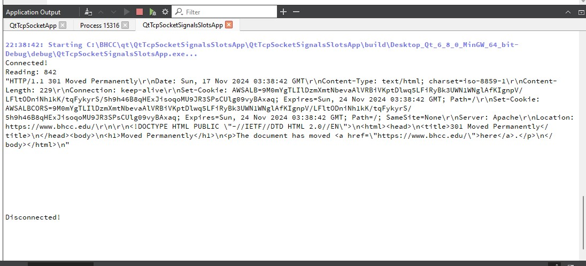

# QtTcpSocketSignalsSlotsApp 
 
## Overview 
The QtTcpSocketSignalsSlotsApp is a Qt console application that demonstrates the use of QTcpSocket with signals and slots for TCP communication. This project showcases how to establish a TCP connection, send an HTTP GET request, and read the response using Qt's powerful networking capabilities. 
 
## Project Structure 
\``` 
QtTcpSocketSignalsSlotsApp.pro 
main.cpp 
mytcpclient.cpp 
mytcpclient.h 
\``` 
 
## Classes and Files 
 
### MyTcpClient Class 
- **File Name:** `mytcpclient.h`, `mytcpclient.cpp` 
- **Description:** Represents a TCP client that uses signals and slots to handle TCP socket events. 
- **Methods:** 
  - `MyTcpClient(QObject *parent = nullptr)`: Constructor to initialize the TCP client. 
  - `void connected()`: Slot called when the socket is connected. 
  - `void disconnected()`: Slot called when the socket is disconnected. 
  - `void readyRead()`: Slot called when data is available to read. 
 
### Main File 
- **File Name:** `main.cpp` 
- **Description:** Entry point of the application. Initializes and starts the TCP client. 
 
## How to Run the Project 
1. **Clone the Repository:** 
  \```sh 
  git clone https://github.com/jentimanatol/QT/tree/main/QtTcpSocketSignalsSlotsApp 
  cd QtTcpSocketSignalsSlotsApp 
  \``` 
 
2. **Open the Project in Qt Creator:** 
  - Open `QtTcpSocketSignalsSlotsApp.pro` in Qt Creator. 
 
3. **Build and Run the Project:** 
  - Click on the "Run" button in Qt Creator to build and run the project. 
 
## Features 
- **TCP Connection:** Establishes a TCP connection to a specified host. 
- **HTTP GET Request:** Sends an HTTP GET request to the host. 
- **Data Reading:** Reads and displays the response from the host. 
 
## Screenshots 
 
 
## Diagrams 
### Project Structure Diagram 
 
 
### UML Diagram 
 
 
## License 
This project is licensed under the MIT License - see the LICENSE file for details. 
 
## Acknowledgements 
- Qt for providing the framework for GUI development. 
- The authors of the C++ libraries used in this project. 
 
## Contact 
